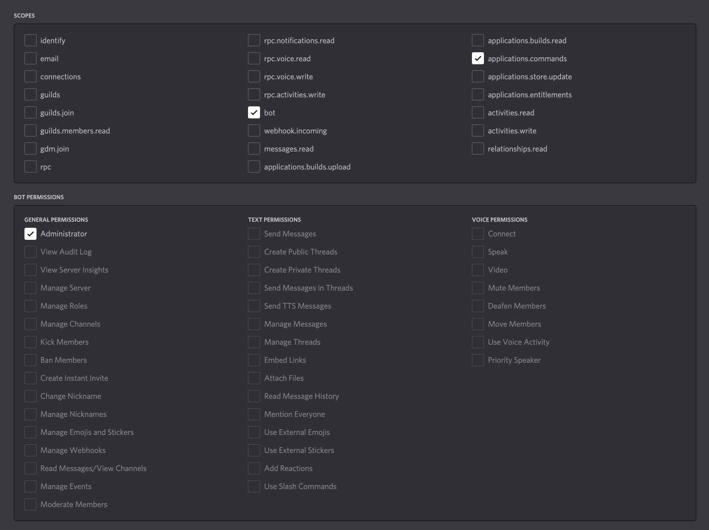

# Habitat

_Habitat.js_ is a library for setting up, maintaining, and interacting with servers of multiple Discord bots.

The purpose of this library to assist in creating ecosystems out of Discord servers using a cast of bots. In other words, to build immersive server experiences where individual bots can represent their own characters or services, and interact with each other as well as humans just as a person might.

## Status

Unpublished.

## Usage

Create a habitat by instantiating one:

```ts
new Habitat(config: HabitatConfig)
```

When the habitat is instantiated, all the provided clients will be spun up.

Once any Discord server begins inviting the related clients, the server will be transformed into the shape of the instantiated habitat.

### Types

#### `HabitatConfig`

A `HabitatConfig` consists of many `Enforce Data` which each represent a piece of a server to enforce. An example interface for `HabitatConfig` is

```ts
interface HabitatConfig {
  admin: EnforceClientData[]
  channels?: EnforceChannelData[]
  clients?: EnforceClientData[]
  roles?: EnforceRoleData[]
}
```

#### `Enforce Data`

`Enforce Data` are types that wrap Discord.js types. Everything in an `Enforce Data` interface represents what is needed to create an initial instance of that thing.

For example, the `EnforceClientData` interface is

```ts
interface EnforceClientData {
  commands?: EnforceCommandData[]
  options?: ClientOptions
  presence?: undefined // TODO: PresenceData
  roles?: undefined // TODO: EnforceRoleData[]
  token: string
  userData?: ClientUserEditData
}
```

The fields above encapsulate what is needed to initially create a client and set its appearance.

Note: Enforcement usually only runs when the server is started and when bots are first added to a server. Client appearances and other data in the server can still be set dynamically. _Habitat.js_ also provides helper methods for more complex bot behavior.

### Client setup

The goal of the library is help manage an environment of multiple bots. It will be important to give each bot client the appropriate scopes/permissions in order for them to work with _Habitat.js_.

The admin client is in charge of managing guild enforcement, or server setup, and needs the following scopes and permissions.



All other clients require the same scopes as the admin client. However, they don't need to ask for any permissions since the admin bot will manage those later.

#### Inviting

After setting up the admin client, invite the bot to your server. From within your server, run the `/setup` command to get help on inviting your other bots.

## Development

### Installation

1. Clone or fork the repository.
2. Install Node. You can use [nvm](https://github.com/nvm-sh/nvm) or [the official download page](https://nodejs.org/en/download/).
   Make sure you download a version campatible with the latest stable version of Discord.js. Please reference [the Discord.js documentation](https://discord.js.org/#/docs/discord.js/stable/general/welcome).
3. Install [Yarn](https://classic.yarnpkg.com/lang/en/docs/install/#mac-stable).
4. Navigate into the project folder and run `yarn`.
5. If you plan on running the demo, make sure to follow the instructions under [Client setup](#client-setup) to setup your clients.
6. Done!
